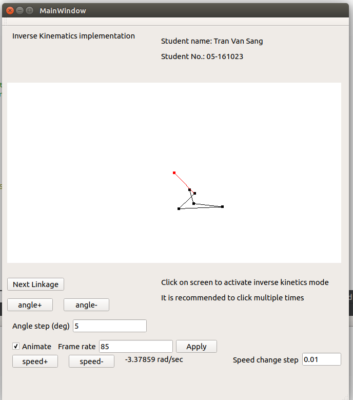

# Inverse kinematics in OpenGL with Qt

## Usage

- Install [Qt Creator](https://www.qt.io/ide/) (free)
- Open InverseKinematic/InverseKinematic.pro
- Hit `Run`

Note: this project was created by Qt 5.9

Screenshots:

